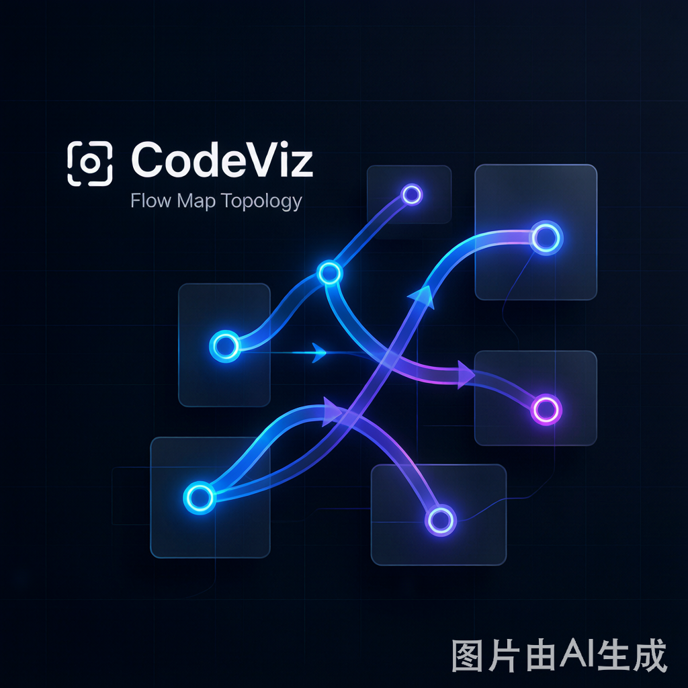

# CodeViz - Realtime Project Progress Visualizer

<p align="center">
  
</p>

<p align="center">
  <strong>专为 AI 时代终端开发者打造的“项目进度图纸” ─ 让你的第二屏幕动起来。</strong>
</p>

<p align="center">
  <a href="#-核心优势">核心优势</a> •
  <a href="#-工作原理">工作原理</a> •
  <a href="#-快速开始">快速开始</a> •
  <a href="#-tasksmd-语法">任务大纲定义</a>
</p>

---

## 💡 为什么需要 CodeViz？

在使用 **Claude Code / Codex / Gemini CLI** 等命令行 AI 编程工具，或者与智能 Agent swarms 协作开发时，开发者常常会面临**全局进度迷失**的痛点：
* `tasks.md` 或大纲文件只是一个沉闷的纯文本，每次都需要靠大脑去“扫描”当前究竟做到了哪一步。
* 缺乏直观的依赖网络视图，不知道改动这行代码会不会卡住后续其他的并行任务。
* 老板或 PM 想要了解进度时，无法给出一个一目了然的可视化看板。

**CodeViz 专为解决此痛点而生！** 它不替代任何现有 AI 开发流程，而是作为**项目进度大纲的可视化伴侣**。它吃掉符合 Spec Kit 规范（或通用 Markdown 格式）的 `tasks.md`，直接在你的侧屏渲染出一张具有**玻璃拟态质感、动态 SVG 连线流光、四色联动**的项目进度拓扑图。

---

## ✨ 核心亮点

- ⚡ **零 npm 依赖**：全量基于 Node.js 22+ 内置模块实现（原生 HTTP API 与 WebSocket 服务），没有烦人的三方依赖安装，轻量秒级启动。
- 🔗 **Spec Kit 深度对齐**：完美兼容官方 `tasks.md` 格式。自动解析任务 ID、依赖链（`depends:`）、并行标记（`[P]`）以及变更关联文件。
- 🔮 **多级智能进度推断**：
  1. **手动状态**：由任务大纲直接标注的 `[x]`（已完成）或 `[ ]`。
  2. **Git Commit 嗅探**：后台异步嗅探 git commit 消息和改动文件。只要检测到包含任务 ID，或者提交改动了对应的 `files`，即便未手动打勾，节点也会自动亮黄转为 `in-progress`。
  3. **文件存在校验**：只要任务关联的源文件被成功创建，即刻触发 `in-progress` 推进。
- 🎨 **极客美学 UI & 60fps 动效**：基于极简轻量的前端体系。流线型贝塞尔连线带有 `animateMotion` 的光点流动，自适应屏幕与多阶段（Phase）双排精美布局，且全面支持 **Light / Dark / System** 智能三态主题切换。
- 📂 **单服务多项目并行管理**：支持单端口拉起，左侧项目列表智能切换，避免本地多开造成的端口冲突。

---

## 🛠️ 工作原理

CodeViz 作为一个后台微服务，监听大纲文件与代码改动：

```
+------------------+         (fs.watch)          +------------------+
|  Your Workspace  | --------------------------> |  CodeViz Server  |
|  (plan/tasks.md) |                             |  (Node 22 API)   |
+------------------+                             +------------------+
         | (git commit / file add)                        |
         v                                                v (WebSocket)
+------------------+                             +------------------+
|   Git History    | <--- (Auto Infer Status) -- |  Mindmap Client  |
|  & File System   |                             |  (Browser View)  |
+------------------+                             +------------------+
```

---

## 🚀 快速开始

### 1. 安装与注册 (Claude Code 插件一键安装)
克隆项目后，在根目录下运行安装脚本，它会动态检测克隆目录并自动注册到你的 Claude 全局技能路径下：
```bash
node bin/install.js
```
*如需卸载，运行 `node bin/install.js --uninstall` 即可安全清除。*

### 2. 运行服务
进入 `codeviz-skill/` 并运行：
```bash
# 启动并监听当前项目
node bin/codeviz.js

# 监听指定目录项目
node bin/codeviz.js /path/to/your/project

# 启动示例项目服务演示（不弹出浏览器）
node bin/codeviz.js examples --port 7879 --no-open
```

命令行参数支持：
- `--port PORT`：设置本地静态与 WebSocket 通信端口，默认 `7878`。
- `--no-open`：只后台启动服务，禁止强制弹出默认浏览器。

### 3. 打开第二屏幕
在浏览器中打开：[http://localhost:7878](http://localhost:7878)。

把窗口甩到你的第二块屏幕上，接下来你在终端里通过 Claude Code 或是手动编写代码改动大纲，右侧的导图节点都会自动**流光闪烁并实时变化颜色**！

---

## 📝 tasks.md 任务大纲语法

兼容两种最常见的 Markdown 大纲格式：

### 格式 A：清单式（Spec Kit 常见风格）
```markdown
# Tasks: 博客系统

## Phase 1: 基础设施配置
- [ ] T001 [P] 初始化项目脚手架 (files: package.json, vite.config.ts)
- [x] T002 - 集成 Tailwind CSS (depends: T001; files: tailwind.config.js, src/style.css)
```

### 格式 B：标题式
```markdown
# Tasks: 个人博客系统

## Phase 1: 基础设施

### T001 - 初始化项目脚手架
- files: package.json, vite.config.ts
- [x] 初始化 Vite + Vue 3 项目

### T002 - 配置 Tailwind CSS [P]
- depends: T001
- files: tailwind.config.js, src/style.css
- [ ] 集成 Tailwind CSS 4.0 样式
```

---

## 🚦 四态颜色定义
- **未开始 (Pending - 灰色)**：项目任务尚未介入，文件和 commit 均不存在。
- **进行中 (In Progress - 黄色)**：任务相关的 `files` 文件已被创建，或者有 commit 修改了相关文件。
- **已完成 (Done - 绿色)**：大纲中标记了 `[x]` 或已通过 TDD 校验。
- **报错卡住 (Error - 红色)**：代码构建报错、大纲行内包含 `FAILED` / `ERROR` 标记。
